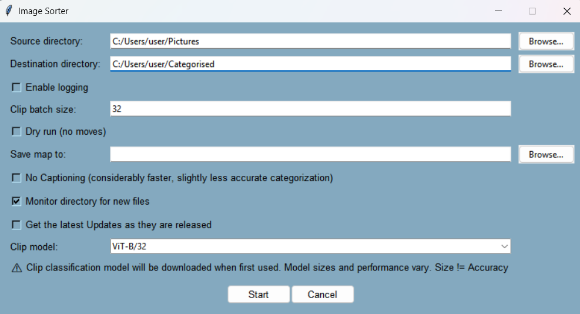

# Image Sorter

LEGAL DISCLAIMER:
 - This freeware is provided as-is and without warranty.
   By downloading, THE USER acknowledges that the Author of this software will NOT accept liability for any loss or potential harm arising from its use.

**Image Sorter** is a content‑aware utility that helps you bring order to large collections of photographs, illustrations and artwork.  Powered by OpenAI’s CLIP model for zero‑shot image classification, it groups your pictures into broad *style* categories (e.g., photography, illustration, fantasy art) and then further organises them by *subject* such as animals, landscapes or people.  An optional BLIP captioner generates descriptive filenames so that each image is easy to recognise even outside the organiser.  With a simple graphical interface or a command‑line mode, Image Sorter streamlines curation of your visual library and can monitor folders for new files.

Important user Notes:
 - Captioning will replace the filename with the caption. If this behaviour is undesired, Be sure to Select 'No Captioning' 
 - Captioning is resource intensive. It is not recommended for people who do not Have a Cuda capable graphics card
 - This program has a self-update feature. Updating is Opt in. It is recommended to [review updates](https://github.com/T3RRYT3RR0R/Image-Sorter/tree/main/updates) prior to opting in.
 
## Key features

* **Simple GUI or CLI** – When you run `image‑sorter.exe` without command‑line arguments an interactive form is displayed.  You can select a source directory, a destination, the batch size used when feeding images to CLIP, opt into a dry‑run, save a mapping of moved files, disable captioning for faster operation, monitor the source directory for new files and choose a CLIP model from a drop‑down list.
* **Zero‑shot style categorisation** – A set of **root categories** provides broad buckets such as *astrophotography*, *photography*, *illustration*, *fantasy art*, *macro photography*, *sketch*, *anime*, *painting* and *abstract*.  CLIP text prompts are automatically constructed from these categories and the subject list, and the model picks the best matching pair.
* **Subject detection and captioning** – The default **subjects** list includes dozens of common themes (e.g., `fairy`, `cat`, `windmill`, `sunset`, `space`).  After classification, an optional BLIP captioner produces natural language descriptions.  These captions can rename images using safe, slugified filenames and provide context for the classification.
* **Smart heuristics** – Dictionaries of *filter* words (e.g. “nsfw” triggers a special folder), *subject overrides* and *category overrides* allow the script to correct poor predictions based on caption keywords.  A *collate mapping* groups semantically similar subjects under a single folder (e.g. `sunrise` and `sun rays` fall under `sunset`).
* **Self‑updating** – By default the program runs completely offline, but you can enable automatic update checks to download any new patches from the repository.
* **Cross‑platform file operations** – On Windows, creation times are preserved when moving files across disks; on all platforms the tool handles long paths and rejects identical source/destination directories.

## Installation and release download

1. Visit the [v0.0.1 release page](https://github.com/T3RRYT3RR0R/Image-Sorter/releases/tag/v0.0.1) on GitHub.  The assets list contains a multi‑part 7‑Zip archive named **`Image‑Sorter.7z.001`**.  Download **all** `.7z.00X` parts provided in that release (these split files collectively contain the Windows executable and supporting files).
2. Use [7‑Zip](https://www.7-zip.org/) on Windows or the `7z` command on Linux/macOS to extract the archive.  Right‑click the `.001` file and choose “Extract here” with 7‑Zip; the program automatically stitches together the split files.
3. Open the extracted folder.  The main executable is `image‑sorter.exe`.  You can run it directly from Explorer or via the command line.

## Using Image Sorter

### Graphical interface

Running the program without arguments launches a friendly dialog.  Fields and check boxes correspond to command‑line options:

| Setting | Description |
|---|---|
| **Source directory** | Folder containing the images you want to organise.  Sub‑folders are not traversed. |
| **Destination directory** | Root folder where sorted images will be copied/moved.  The tool creates category/subject subfolders automatically. |
| **Enable logging** | Writes a log of moved files to standard output. |
| **Clip batch size** | Number of images processed at once by the CLIP encoder.  Larger batches speed up GPU runs but increase memory usage. |
| **Dry run** | Simulates moves and renames without actually modifying files.  Useful for testing your configuration. |
| **Save map to** | Optional location to write a JSON file mapping original paths to destination paths. |
| **No captioning** | Skips BLIP captioning and renaming for faster throughput.  Classification is slightly less accurate without captions. |
| **Monitor directory** | When enabled the app watches the source folder and automatically processes new images as they appear. |
| **Get latest Updates** | Enables self‑update checks. |
| **Clip model** | Choose a CLIP variant (e.g. `ViT‑B/32`, `ViT‑L/14`) or type in a model name.  Larger models may improve accuracy at the cost of slower downloads and inference. |

Below is a screenshot of the GUI illustrating these controls:



To start sorting images, choose your source and destination, adjust any optional settings and click **Start**.  Progress is displayed in the console window, and the program closes when all images are processed - unless the watch directory option is active.

### Command‑line mode

All GUI options are also available via a unified command‑line interface.  For example:

```bash
image‑sorter.exe "C:\Users\user\Pictures" --dest "C:\Users\user\Categorised" --clip-batch 16 --no-captioning --monitor --clip-model ViT-B/32
```

Omit all optional flags to accept the defaults.  A help message describing all available arguments can be displayed with `--help`.

## Customising categories, subjects and rules

Out of the box Image Sorter uses predefined categories, subjects and rules, but it is fully customisable. The program reads configuration files from a **`config`** subfolder alongside the executable.  Each file overrides one of the built‑in dictionaries listed in the `RULES_CONFIG` tuple.  At start‑up the function `load_custom_rule_dicts` looks for corresponding `*.py` files and injects the new definitions.

For the default values of RULES_CONFIG dictionaries and further details on their application, refer to the [Dictionary_Defaults](https://github.com/T3RRYT3RR0R/Image-Sorter/blob/main/Dictionary_Defaults.txt)

To customise the taxonomy:

1. Create a folder called **`config`** next to `image‑sorter.exe` (if it does not already exist).
2. For each dictionary you want to override, create a file named after it with a `.py` extension.  For example:
   - **`ROOT_CATEGORIES.py`** – Define a Python list called `ROOT_CATEGORIES` with your own high‑level categories.  Categories must be distinct and each one must have a corresponding entry in the `PROMPT_TEMPLATES` dictionary.
   - **`SUBJECTS.py`** – Provide a list named `SUBJECTS` containing the subjects CLIP can assign.  Avoid conceptual overlap between items.
   - **`PROMPT_TEMPLATES.py`** – Supply a dictionary called `PROMPT_TEMPLATES` mapping each category to a list of natural‑language prompts used to build CLIP embeddings.  Include a `{subject}` placeholder where the subject name should appear.
   - **`FILTER.py`**, **`COLLATE_MAPPING.py`**, **`SUBJECT_OVERRIDE_RULES.py`**, **`STRICT_CATEGORY_OVERRIDE_RULES.py`**, and **`CATEGORY_OVERRIDE_RULES.py`** – Define dictionaries with the same names respectively to: tweak NSFW filtering, group similar subjects, or bias categories/subjects based on caption keywords.
3. Each file should assign the appropriate variable; no other code is necessary.  When Image Sorter starts, it reports `✅ Custom rule applied for '<dict_name>'` for each successfully loaded override.

For example, to add a *digital art* category and customise the prompt templates, create **`ROOT_CATEGORIES.py`** with:

```python
ROOT_CATEGORIES = [
    "digital art", "photography", "illustration", "fantasy art",
    "macro photography", "sketch", "anime", "painting", "abstract"
]
```

and **`PROMPT_TEMPLATES.py`** with:

```python
PROMPT_TEMPLATES = {
    "digital art": [
        "a detailed digital painting of a {subject}",
        "digital artwork of a {subject} in high resolution"
    ],
    # include templates for your other categories...
}
```

After saving these files the program will categorise images into a new “digital art” folder using your prompt templates when the CLIP model score matches with the prompt.  Similar approaches apply when refining subjects or override rules.

## License and acknowledgements
This software was developed with the Aid of ChatGPT-5 and VisualStudio CoPilot
Made possible thanks to the Huggingface open source community

Image Sorter is distributed under a Creative commons universal license; see the [LICENSE](https://github.com/T3RRYT3RR0R/Image-Sorter/blob/main/LICENSE) file for details.  It leverages OpenAI’s [CLIP](https://huggingface.co/openai/clip-vit-base-patch32) model to perform Zero‑Shot Classification and Salesforce’s [BLIP](https://huggingface.co/Salesforce/blip-image-captioning-base) image captioner for captioning.
